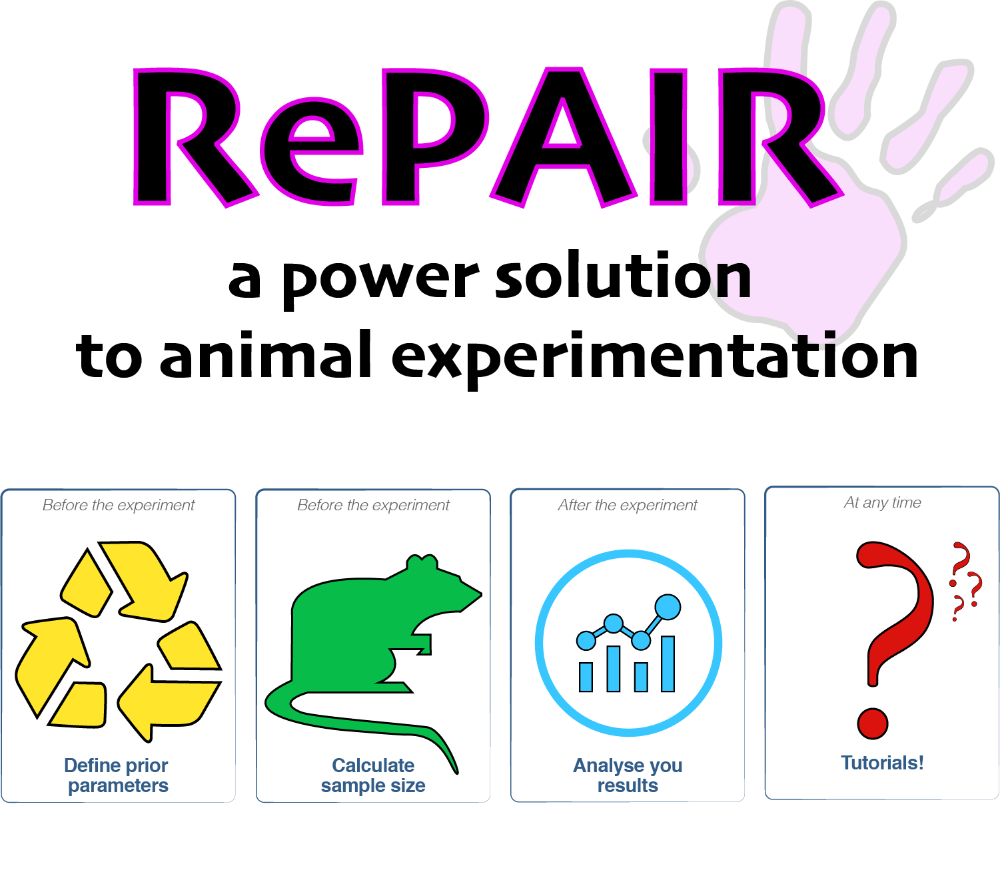

# RePAIR
**DOI:** [10.17605/OSF.IO/WVS7M](https://osf.io/wvs7m/)
<br>
**Version:** 0.1.0

<br>
<p align="center">
  
</p>


<br>
<br>

**R**eduction by **P**rior **A**nimal **I**nformed **R**esearch (*RePAIR*) is a statistical tool to limit the number of animals to conduct well-powered research. This github project accompanies the homonymous manuscript, which can be downloaded at [this link](https://www.biorxiv.org/content/10.1101/864652v1). 

<br>
For an **interactive** use of RePAIR, see our [shiny app](https://vbonapersona.shinyapps.io/repair_app_submit/).

<br> 
<br>

## Project organization

```
.
├── .gitignore
├── CITATION.md
├── LICENSE.md
├── README.md
├── data                  <- All project data, ignored by git.
│   ├── final             <- The final, canonical data sets used for analyses. 
│   ├── raw               <- The original data, directly downloaded from the repository. 
│   └── temp              <- Intermediate data.
├── results
│   ├── figures           <- Figures for the manuscript or reports.
│       ├── intermediate  <- Intermediate visualizations and data for final figures. 
│       ├── final         <- The final visualizations as present in the manuscript.
│       └── other         <- Other figures unrelated to the analysis.
│   └── output            <- Other output for the manuscript or reports.
└── src                   <- Source code for this project. 


```

## Getting started
To get started: 

* run the *dependencies.R* script, with which you can automatically download all required packages.
* run the *download_data.R* to download data directly from the openscience framework. 

<br>
**Attention:** 
<br>
The **package osfr** here used to download data directly from the [repository](https://osf.io/) is currently being developed. If automatic download does not work, copy the data files found at [this link](https://osf.io/wvs7m/) to the *data/raw/* folder in your directory. The files names are: 

* meta_effectsize.csv
* meta_n.csv
* RELACS_anonymized_blinded.csv
* RELACS_prior_control_literature.csv

<br>

## Brief description of R scripts
The analysis is coded in 6 different R scripts: 

* **RePAIR_functions.R**: sourced by all other R scripts, it contains libraries, functions, paths and other general variables (e.g. color codes)
* **power_literature.R**: descriptive analysis and estimation of statistical power in preclinical literature. It outputs all relevant information for Figure 1 and 2C of the manuscript, as well as several supplementary figures.
* **RePAIR_simulation.R**: script of the simulation study to study the relationship between between prior, sample size and prospective statistical power. It outputs a .csv file containing the output of the simulation, and a graph for its visualization (Figure 2A of the manuscript). 
* **RePAIR_prior.R**: analysis of the prior literature selected to gather information for the sensitivity analysis (conducted with script *RePAIR_sensitivity.R*).
* **RePAIR_sensitivity.R**: sensitivity simulation to validate the robustity of RePAIR. It outputs a csv file with the output of the sensitivity simulation study, as well as a graph for its visualization (Supplementary Figure 5 of the manuscript). <u> Attention:</u> it requires the output of RePAIR_prior.R. Therefore, **run *RePAIR_prior.R* first**. 
* **RePAIR_relacs.R**: tryout of RePAIR on a real life dataset (RELACS). It outputs Figure 2B as well as well as other supplementary information. 

The code for the final visualization of the figures as presented in the manuscript is **main_figures.R**. <u>Attention:</u> this script sources outputs of other scripts. Therefore, the related figure outputs need to be present at the required locations. 

<br>

## Requirements
The scripts here reported were written in R version 3.6.0, running under macOS Mojave 10.14.6.

The following R **base** packages were used: 

* grid
* stats
* graphics
* grDevices
* utils
* methods
* base


The **additional** R packages used were:

* [tidyverse, v 1.3.0](https://www.tidyverse.org/)
* [osfr, v 0.2.6.2](https://github.com/CenterForOpenScience/osfr)
* [readxl, v 1.3.1](https://cran.r-project.org/web/packages/readxl/index.html)
* [assertive, v 0.3-5](https://cran.r-project.org/web/packages/assertive/index.html)
* [docstring, v 1.0.0](https://cran.r-project.org/web/packages/docstring/index.html)
* [pwr, v 1.2-2](https://cran.r-project.org/web/packages/pwr/index.html)
* [metafor, v 2.1-0](http://www.metafor-project.org/doku.php)
* [ggpubr, v 0.2.4](https://cran.r-project.org/web/packages/ggpubr/index.html)
* [viridis, v 0.5.1](https://cran.r-project.org/web/packages/viridis/index.html)
* [gtable, v 0.3.0](https://cran.r-project.org/web/packages/gtable/index.html)


<br>

## Known bugs
Nothing so far!

<br>

## License
This project is licensed under the terms of the [MIT License](/LICENSE.md)

<br>

## Citation
Please [cite this project as described here](/CITATION.md).

<br>

## Credits and acknowledgements

* Marian Joels, Herbert Hoijtink and Angela Sarabdjitsingh for the impeccable supervision
* Members of the RELACS consortium for donating their data
* Jelle Knop and Milou Sep for the helpful discussions
* Prof. Ron de Kloet for critically reviewing the manuscript

